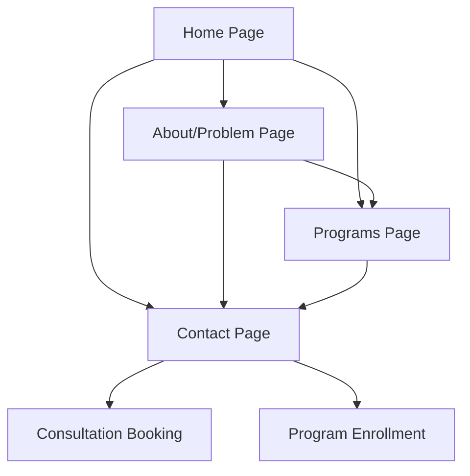

# WhySchool - Product Requirements Document

## 1. Product Overview

WhySchool is an innovative educational platform that bridges the gap between classroom learning and real-world application, helping students move from curiosity → clarity → confidence through hands-on experience.

The platform addresses the critical missing layer in education - the "why" behind learning - by providing structured exposure across technology, design, finance, and entrepreneurship, enabling students to discover their true interests before college.

Our target is to transform how students understand their future careers by connecting classroom knowledge to real-world purpose, creating a generation of confident, direction-focused learners.

## 2. Core Features

### 2.1 User Roles

| Role | Registration Method | Core Permissions |
|------|---------------------|------------------|
| Visitor | No registration required | Can browse all content, view program information |
| Interested Parent | Contact form submission | Can request detailed information, schedule consultations |
| Student Participant | Parent enrollment | Can access program materials, track progress |

### 2.2 Feature Module

Our WhySchool website consists of the following main pages:

1. **Home Page**: Hero section with core messaging, problem statement, navigation to key sections
2. **About/Problem Page**: Detailed explanation of the educational gap and our solution approach  
3. **Programs Page**: Hands-on exposure programs across different domains (technology, design, finance, entrepreneurship)
4. **Approach Page**: Our methodology of building understanding through experience
5. **Contact Page**: Inquiry forms for parents, consultation booking, contact information

### 2.3 Page Details

| Page Name | Module Name | Feature description |
|-----------|-------------|---------------------|
| Home Page | Hero Section | Display compelling headline "Bringing Real-World Clarity to Students Early" with engaging visuals and call-to-action |
| Home Page | Problem Overview | Present the core problem of missing hands-on exposure in current education system |
| Home Page | Solution Preview | Brief overview of how WhySchool bridges the gap with real-world experience |
| Home Page | Navigation Menu | Easy access to all main sections with clear, intuitive labels |
| About/Problem Page | Problem Deep Dive | Detailed explanation of the missing "why" layer in education with real examples |
| About/Problem Page | Current System Analysis | Analysis of how students get stuck in endless learning without clarity |
| About/Problem Page | The Missing Layer | Explanation of why understanding "why" builds deeper learning connections |
| Programs Page | Domain Exploration | Showcase hands-on programs in technology, design, finance, and entrepreneurship |
| Programs Page | Experience Methodology | Explain how students "feel" what it's like to work in different fields |
| Programs Page | Program Benefits | List outcomes: explore domains safely, understand industry functions, recognize natural fit |
| Approach Page | Philosophy Statement | "We don't build roadmaps for students. We help them build understanding through experience" |
| Approach Page | Learning Journey | Visual representation of curiosity → clarity → confidence progression |
| Approach Page | Hands-on Focus | Emphasis on experience over theory, doing over learning about |
| Contact Page | Parent Inquiry Form | Capture parent contact details, student age, areas of interest |
| Contact Page | Consultation Booking | Schedule one-on-one discussions about student needs |
| Contact Page | Contact Information | Phone, email, location details for direct communication |

## 3. Core Process

**Visitor Flow:**
Visitors land on the homepage where they immediately understand the core problem WhySchool solves. They can explore the detailed problem explanation, learn about our hands-on approach, browse available programs, and ultimately contact us for their student's enrollment.

**Parent Engagement Flow:**
Parents discover WhySchool through the compelling problem statement, explore how our approach differs from traditional education, review specific programs available, and submit inquiries or book consultations to discuss their student's needs.

**Student Journey Flow:**
Students (through parents) move from initial curiosity about different fields, gain clarity through hands-on exposure programs, and build confidence in their chosen direction before reaching college-level decisions.

## 4. User Interface Design

### 4.1 Design Style

- **Primary Colors**: Deep blue (#1e3a8a) for trust and education, bright orange (#f97316) for energy and innovation
- **Secondary Colors**: Light gray (#f8fafc) for backgrounds, dark gray (#1f2937) for text
- **Button Style**: Rounded corners with subtle shadows, hover animations for engagement
- **Typography**: Modern sans-serif fonts (Inter or similar), 16px base size, clear hierarchy with bold headings
- **Layout Style**: Clean, spacious design with card-based content sections, top navigation with sticky header
- **Icons**: Simple, outlined icons for programs and features, consistent style throughout
- **Animation**: Subtle fade-ins and hover effects, smooth transitions between sections

### 4.2 Page Design Overview

| Page Name | Module Name | UI Elements |
|-----------|-------------|-------------|
| Home Page | Hero Section | Large background image of students in action, bold headline text, prominent CTA button with orange accent |
| Home Page | Problem Overview | Split layout with text on left, illustrative graphics on right, clean typography hierarchy |
| About/Problem Page | Problem Deep Dive | Long-form content with break-out quotes, infographics showing education gaps, engaging visuals |
| Programs Page | Domain Cards | Grid layout of program cards with icons, brief descriptions, and "Learn More" buttons |
| Programs Page | Experience Showcase | Before/after student testimonials, visual journey maps, interactive elements |
| Approach Page | Philosophy Display | Large quote blocks, visual metaphors for learning journey, step-by-step process illustration |
| Contact Page | Inquiry Form | Clean form design with validation, multiple contact options, consultation calendar integration |

### 4.3 Responsiveness

The website is mobile-first responsive design, optimizing for smartphone and tablet viewing while maintaining desktop functionality. Touch-friendly navigation and form elements ensure smooth interaction across all devices, with particular attention to parent mobile usage patterns.