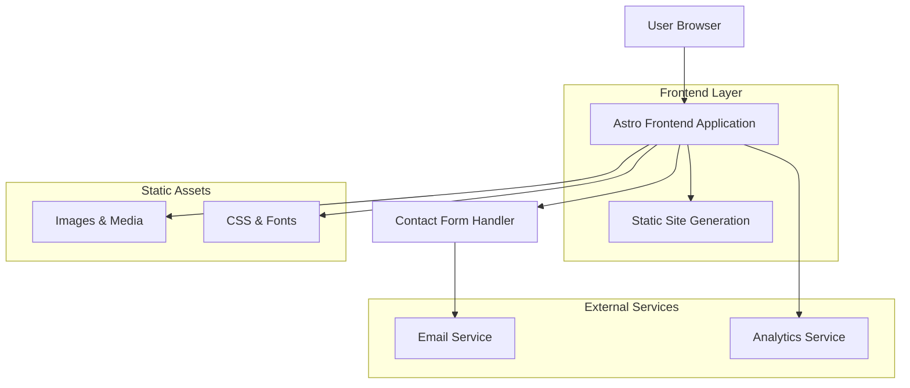

# WhySchool - Technical Architecture Document

## 1. Architecture Design



## 2. Technology Description

- Frontend: Astro@4 + React@18 + Tailwind CSS@3 + TypeScript
- Build Tool: Vite (integrated with Astro)
- Deployment: Static site generation for optimal performance and SEO
- Forms: Netlify Forms or Formspree for contact form handling
- Analytics: Google Analytics or Plausible for visitor tracking

## 3. Route Definitions

| Route | Purpose |
|-------|---------|
| / | Home page with hero section, problem overview, and navigation |
| /about | Detailed problem explanation and WhySchool's solution approach |
| /programs | Hands-on exposure programs across different domains |
| /approach | Our methodology and learning philosophy |
| /contact | Parent inquiry forms and consultation booking |

## 4. Component Architecture

### 4.1 Core Components

**Layout Components**
```typescript
// Header component with navigation
interface HeaderProps {
  currentPath: string;
}

// Footer component with contact info
interface FooterProps {
  showNewsletter?: boolean;
}
```

**Content Components**
```typescript
// Hero section for homepage
interface HeroSectionProps {
  title: string;
  subtitle: string;
  ctaText: string;
  ctaLink: string;
  backgroundImage?: string;
}

// Program card for programs page
interface ProgramCardProps {
  title: string;
  description: string;
  domain: 'technology' | 'design' | 'finance' | 'entrepreneurship';
  icon: string;
  features: string[];
}

// Contact form component
interface ContactFormProps {
  formType: 'inquiry' | 'consultation';
  onSubmit: (data: ContactFormData) => void;
}

interface ContactFormData {
  parentName: string;
  email: string;
  phone: string;
  studentAge: number;
  interestedDomains: string[];
  message: string;
}
```

### 4.2 Form Handling

Contact form submission
```
POST /api/contact
```

Request:
| Param Name | Param Type | isRequired | Description |
|------------|------------|------------|-------------|
| parentName | string | true | Parent's full name |
| email | string | true | Contact email address |
| phone | string | false | Phone number for callback |
| studentAge | number | true | Student's current age |
| interestedDomains | string[] | true | Selected program domains |
| message | string | false | Additional questions or comments |

Response:
| Param Name | Param Type | Description |
|------------|------------|-------------|
| success | boolean | Form submission status |
| message | string | Confirmation or error message |

Example Request:
```json
{
  "parentName": "Sarah Johnson",
  "email": "sarah.johnson@email.com",
  "phone": "+1-555-0123",
  "studentAge": 16,
  "interestedDomains": ["technology", "design"],
  "message": "Interested in learning more about the technology program for my daughter."
}
```

## 5. Content Management

### 5.1 Static Content Structure

```
src/
├── components/
│   ├── layout/
│   │   ├── Header.astro
│   │   ├── Footer.astro
│   │   └── Layout.astro
│   ├── sections/
│   │   ├── HeroSection.astro
│   │   ├── ProblemSection.astro
│   │   ├── SolutionSection.astro
│   │   └── ProgramsGrid.astro
│   └── forms/
│       ├── ContactForm.tsx
│       └── ConsultationForm.tsx
├── pages/
│   ├── index.astro
│   ├── about.astro
│   ├── programs.astro
│   ├── approach.astro
│   └── contact.astro
├── content/
│   ├── programs/
│   │   ├── technology.md
│   │   ├── design.md
│   │   ├── finance.md
│   │   └── entrepreneurship.md
│   └── testimonials/
└── assets/
    ├── images/
    └── styles/
```

### 5.2 Content Schema

Program content structure:
```typescript
interface Program {
  title: string;
  domain: string;
  description: string;
  duration: string;
  ageGroup: string;
  keyLearnings: string[];
  handsOnActivities: string[];
  realWorldConnections: string[];
  outcomes: string[];
}
```

## 6. Performance Optimization

### 6.1 Static Site Generation
- Pre-built HTML pages for instant loading
- Optimized images with Astro's built-in image optimization
- CSS and JavaScript bundling and minification
- Critical CSS inlining for above-the-fold content

### 6.2 SEO Optimization
- Server-side rendering for search engine crawling
- Structured data markup for program information
- Meta tags optimization for social sharing
- Sitemap generation for search engine indexing
- Fast loading times for improved search rankings

### 6.3 Asset Management
- Image compression and WebP format support
- Font optimization with font-display: swap
- CSS purging to remove unused styles
- JavaScript code splitting for faster initial loads